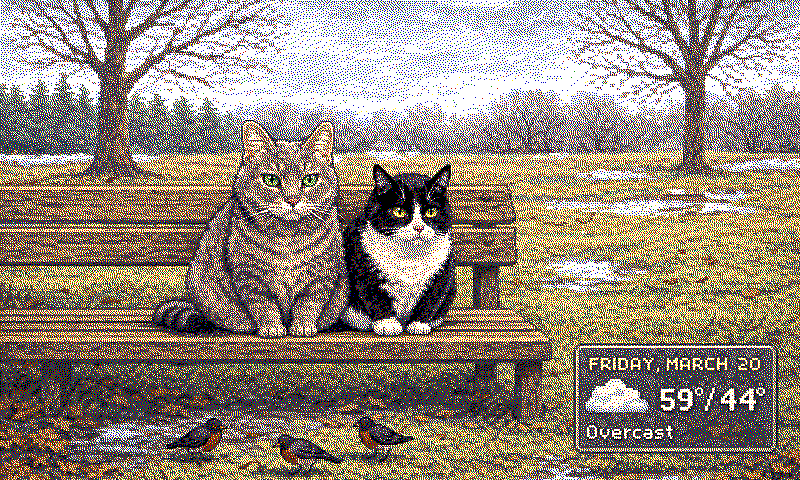
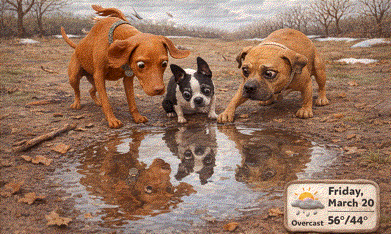

# Petcast

AI-generated daily pet weather forecasts for e-ink displays. Heavily inspired by [forecats](https://github.com/jwardbond/forecats).

Petcast picks your pets, checks the weather, generates a styled scene with an integrated forecast panel via OpenAI, dithers it for a 6-color e-ink palette, and serves it over HTTP for your display to fetch.




## How it works

1. **Pick a photo** — randomly selects a reference photo from your collection. The pets in that photo become the cast for the day.
2. **Fetch weather** — pulls today's forecast from [Open-Meteo](https://open-meteo.com/) (free, no API key needed).
3. **Generate a scene** — GPT-4.1 designs a scene based on the pets, weather, season, location, and a randomly chosen art style.
4. **Generate the image** — gpt-image-1.5 renders the scene with a baked-in forecast panel, using the reference photo for pet likeness.
5. **Dither** — Floyd-Steinberg dithers the image to the Spectra 6 e-ink palette (black, white, red, green, blue, yellow) at 800x480.
6. **Serve** — an HTTP server lets your display fetch the image whenever it's ready.

## Quick start

```bash
# Clone and customize
git clone https://github.com/kylekampy/petcasts.git
cd petcasts

# Add your OpenAI API key
echo "OPENAI_API_KEY=sk-..." > .env

# Install deps
uv sync

# Test weather
uv run python -m petcast weather

# Test selection
uv run python -m petcast select --count 10

# Generate an image (with debug output)
uv run python -m petcast generate --debug

# Start the HTTP server
uv run python -m petcast serve
```

## Docker

```bash
# Build and run
docker compose up -d

# Trigger a generation
curl -X POST http://localhost:7777/api/generate

# Check status
curl http://localhost:7777/api/status

# Fetch the image
curl http://localhost:7777/output/latest.png -o forecast.png
```

The container is also published to GitHub Container Registry:

```bash
docker pull ghcr.io/kylekampy/petcasts:latest
```

## Fork and make it your own

1. **Fork this repo**
2. **Replace the pet photos** in `pets/input/` with your own
3. **Edit `pets/meta/pets.yaml`** — name each pet, describe their appearance and personality, and list which photos they appear in
4. **Edit `config.yaml`** — set your location (lat/lon), tweak styles, adjust cooldowns
5. **Add your `OPENAI_API_KEY`** as a repo secret (for the GitHub Action) and in `.env` (for local dev)
6. **Push** — the GitHub Action builds and publishes your container to your own ghcr.io registry

### pets.yaml format

```yaml
pets:
  - name: 'Luna'
    description: >-
      A golden retriever. Fluffy cream coat, dark eyes, always smiling.
      Loves swimming and carrying sticks.
    photos:
      - 'luna_and_max.png'
      - 'luna_solo.png'
  - name: 'Max'
    description: >-
      A black lab. Sleek short coat, brown eyes, floppy ears.
      Ball obsessed. Will not give it back.
    photos:
      - 'luna_and_max.png'
      - 'max_sleeping.png'
```

Photos define natural groupings — if Luna and Max appear in `luna_and_max.png`, they'll sometimes be generated together. Solo photos mean solo scenes.

### config.yaml

```yaml
location:
  name: 'Your City'
  latitude: 40.7128
  longitude: -74.0060

styles:
  - 'comic book pop art with bold outlines and flat colors'
  - 'Japanese woodblock print with strong black outlines'
  # ... add styles that work well with e-ink dithering
```

## Display

Designed for the Waveshare e1002 (800x480, Spectra 6 color e-ink). The display wakes up, POSTs to `/api/generate`, waits a few minutes, then GETs `/output/latest.png` and goes back to sleep.

ESPHome config coming soon.

## API

| Endpoint | Method | Description |
|----------|--------|-------------|
| `/api/generate` | POST | Trigger image generation (returns 202, runs async) |
| `/api/status` | GET | Returns `latest.json` metadata + `generating` flag |
| `/output/latest.png` | GET | The latest generated image |

## Cost

~$0.06 per generation with gpt-image-1.5. At one image per day, that's about **$1.70/month**.
