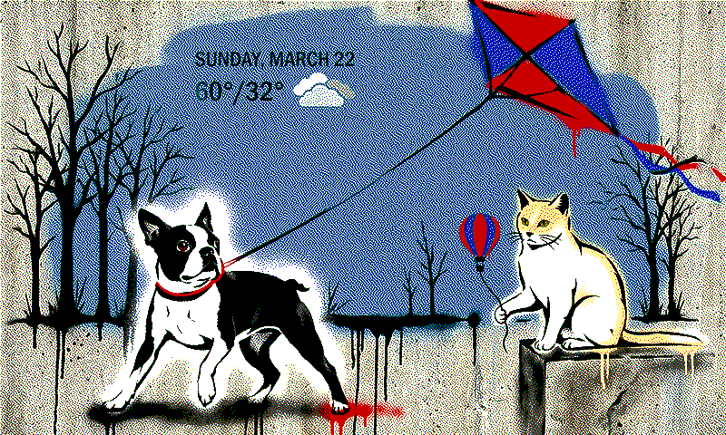
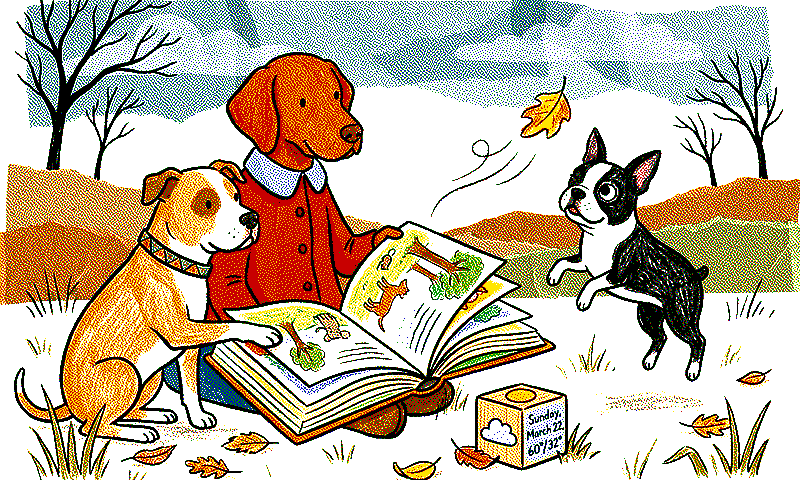
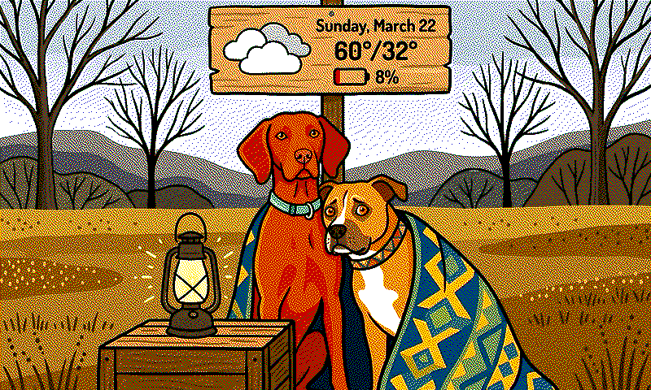
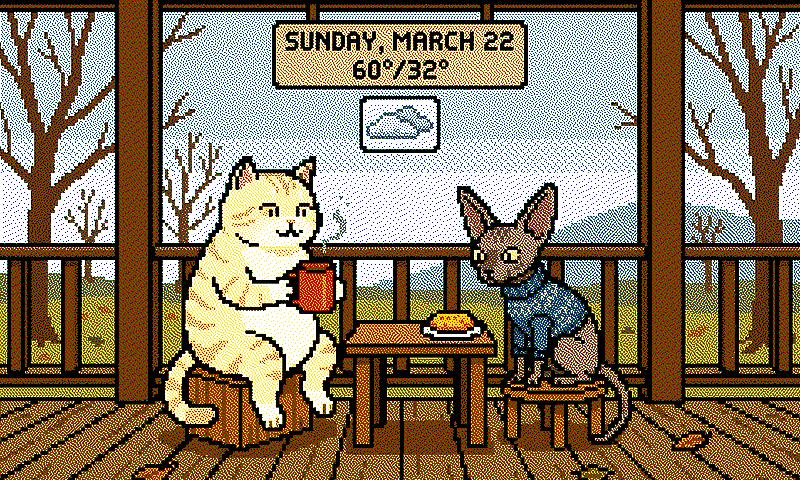

# Petcast

AI-generated daily pet weather forecasts for e-ink displays. Heavily inspired by [forecats](https://github.com/jwardbond/forecats).

Petcast picks your pets, checks the weather, designs a scene with Gemini, renders it with OpenAI `gpt-image-2` (or Gemini — your choice), dithers it for a 6-color e-ink palette, and serves it over HTTP for your display to fetch.






## How it works

1. **Pick a photo** — randomly selects a reference photo from your collection. The pets in that photo become the cast for the day.
2. **Fetch weather** — pulls today's forecast from [Open-Meteo](https://open-meteo.com/) (free, no API key needed). The weather code is computed as the dominant condition across daylight hours (not Open-Meteo's "worst hour wins" default), so a single overcast hour won't turn a sunny day cloudy.
3. **Generate a scene** — Gemini 2.5 Flash designs an anthropomorphic scene where the pets do human-like activities (sipping coffee, flying kites, reading books) appropriate to the weather, season, and location-specific phenology (bare vs. budding vs. leafed-out trees, etc.), described in the visual language of a randomly chosen art style.
4. **Generate the image** — the configured image provider (default: OpenAI `gpt-image-2`; optionally Gemini 3 Pro) renders the scene with creatively integrated weather info (date, temperature, weather icon), using one or more reference photos for pet likeness. The weather info is woven into the art style — on a sign, chalkboard, newspaper, banner, etc.
5. **Dither** — Atkinson dithers the image to the Spectra 6 e-ink palette (black, white, red, green, blue, yellow) at 800x480.
6. **Serve** — an HTTP server lets your display fetch the image whenever it's ready.

## Quick start

```bash
# Clone and customize
git clone https://github.com/kylekampy/petcasts.git
cd petcasts

# Add API keys — Google for scene descriptions (and optionally image), OpenAI for image gen
# Google: https://ai.google.dev  OpenAI: https://platform.openai.com/api-keys
cat > .env <<EOF
GOOGLE_API_KEY=...
OPENAI_API_KEY=...
EOF

# Install deps
uv sync

# Test weather
uv run python -m petcast weather

# Test selection
uv run python -m petcast select --count 10

# Generate an image
uv run python -m petcast generate --debug

# Force a specific style
uv run python -m petcast generate --debug --style graffiti

# Test low battery behavior
uv run python -m petcast generate --debug --battery 8

# Start the HTTP server
uv run python -m petcast serve
```

## Docker

```bash
# Run from GitHub Container Registry
docker run -d \
  --name petcast \
  -p 7777:7777 \
  -e GOOGLE_API_KEY=... \
  -e OPENAI_API_KEY=... \
  -v /opt/volumes/petcast/state:/app/pets/state \
  -v /opt/volumes/petcast/output:/app/output \
  --restart unless-stopped \
  ghcr.io/kylekampy/petcasts:latest

# Trigger a generation
curl -X POST http://localhost:7777/api/generate

# Check status
curl http://localhost:7777/api/status

# Fetch the image
curl http://localhost:7777/output/latest.png -o forecast.png

# Browse past images
curl http://localhost:7777/api/archive
```

## Display

Designed for the [Seeed reTerminal E1002](https://www.seeedstudio.com/reTerminal-E1002-p-6533.html) (800x480, Spectra 6 color e-ink) running [ESPHome](https://esphome.io/).

### How it works

The frame wakes from deep sleep once a day, triggers image generation on the server, fetches the result, updates the e-ink display, and goes back to sleep. The whole cycle takes about 2 minutes.

### Buttons

- **Green** (wake): wakes from deep sleep, fetches latest image
- **Right white** (regenerate): triggers a new generation while awake
- **Left white** (test pattern): toggles a color calibration test pattern

### Battery

The frame sends its battery percentage with each generation request. When battery drops below 15%, the pets in the scene look worried about running out of energy — huddling around dying lanterns, clutching dimming flashlights, etc.

### ESPHome setup

1. Copy `esphome/petcast-frame.yaml` to your ESPHome config directory
2. Create `esphome/secrets.yaml`:
   ```yaml
   wifi_ssid: "your-wifi-ssid"
   wifi_password: "your-wifi-password"
   ap_password: "your-fallback-ap-password"
   ```
3. Update the server URL in `petcast-frame.yaml` (default: `http://mini:7777`)
4. Update the timezone (default: `America/Chicago`)
5. Flash to your ESP32-S3

## Fork and make it your own

1. **Fork this repo**
2. **Replace the pet photos** in `pets/input/` with your own
3. **Edit `pets/meta/pets.yaml`** — name each pet, describe their appearance and personality, and list which photos they appear in
4. **Edit `config.yaml`** — set your location, tweak styles, adjust cooldowns
5. **Add `GOOGLE_API_KEY` and `OPENAI_API_KEY`** as repo secrets (for the GitHub Action) and in `.env` (for local dev). The OpenAI key is only required if `image_provider: openai` in `config.yaml`.
6. **Push** — the GitHub Action builds and publishes your container to your own ghcr.io registry

### pets.yaml format

```yaml
pets:
  - name: "Luna"
    description: >-
      A golden retriever. Fluffy cream coat, dark eyes, always smiling.
      Loves swimming and carrying sticks.
    photos:
      - "luna_and_max.png"
      - "luna_solo.png"
  - name: "Max"
    description: >-
      A black lab. Sleek short coat, brown eyes, floppy ears.
      Ball obsessed. Will not give it back.
    photos:
      - "luna_and_max.png"
      - "max_sleeping.png"
```

Photos define natural groupings — if Luna and Max appear in `luna_and_max.png`, they'll sometimes be generated together. Solo photos mean solo scenes.

## API

| Endpoint | Method | Description |
|----------|--------|-------------|
| `/api/generate` | POST | Trigger image generation (returns 202, runs async). Optional body: `{"battery": 85}` |
| `/api/status` | GET | Latest metadata + `generating` flag |
| `/api/archive` | GET | List all archived images with metadata |
| `/output/latest.png` | GET | Latest dithered image (800×480, for the e-ink frame) |
| `/output/latest_raw.png` | GET | Latest full-quality raw image (1536×1024, for sharing) |
| `/output/latest.json` | GET | Latest metadata |
| `/output/daily/YYYY-MM-DD.png` | GET | Per-day raw image (one per day, overwritten on re-run) |
| `/output/daily/YYYY-MM-DD_eink.png` | GET | Per-day dithered image |
| `/output/daily/YYYY-MM-DD.json` | GET | Per-day metadata |
| `/output/archive/...` | GET | All runs ever, organized by date/time |

## Configuration

Key knobs in `config.yaml`:

```yaml
image_provider: 'openai'   # 'openai' | 'gemini'

openai:
  image_model: 'gpt-image-2'
  quality: 'medium'        # 'low' | 'medium' | 'high'
  size: '1536x1024'        # 3:2 landscape matches the 5:3 crop target

gemini:
  image_model: 'gemini-3-pro-image-preview'
  chat_model: 'gemini-2.5-flash'   # used for the scene description regardless of image provider
```

### Private celebrations

Petcast can add birthdays, anniversaries, holidays, and other special days to
the scene and image prompts. Public holiday support is built in for common U.S.
holidays plus Pi Day and May the Fourth. Private dates go in `config.local.yaml`,
which is ignored by git.

```bash
cp config.local.example.yaml config.local.yaml
```

Example event:

```yaml
celebrations:
  events:
    - id: family-anniversary
      name: Family Anniversary
      kind: anniversary
      date: '2001-06-15'
      message_template: 'Happy {ordinal} Anniversary'
      prompt: >-
        Include all requested pets celebrating together and looking at the
        camera, like a warm group portrait.
      pets: all
      photo: none   # auto-select multiple reference photos if no single photo has all pets
      priority: 90
```

`date` may be `YYYY-MM-DD`, `MM/DD/YY`, `Month D, YYYY`, or a month/day with a
separate `start_year`. Birthday and anniversary events can use `{ordinal}`,
`{years}`, `{name}`, and `{year}` in `message_template`.

Celebration scene ideas are recorded in `pets/state/celebrations.json` so the
prompt can avoid reusing last year's concept for the same event. That file is
also ignored by git.

### Phenology

`src/petcast/scene.py` contains a `_PHENOLOGY_CALENDAR` tuned for the upper Midwest (~44°N) that maps each date range to a landscape description (bare trees vs. budding vs. full canopy, etc.). This is injected into the scene prompt so late-April scenes show tender pale-green leaves, mid-October shows peak fall color, and so on — rather than generic "spring" or "fall" cues. If you're in a different climate, edit the calendar entries in `_phenology` to match your local transitions.

### Styles

Art styles are listed under `styles:` in `config.yaml`. Each is a free-text description; the scene designer leans heavily into the medium's visual language. Styles that work best on 6-color e-ink use flat saturated colors, heavy black outlines, and minimal gradients (pop art, stained glass, Bauhaus, linocut, pixel art, papercut). Subtle/muted palettes and fine textures tend to muddy under dithering.

## Cost

Default: OpenAI `gpt-image-2` at `medium` quality (~$0.053/image) + Gemini 2.5 Flash for the scene (~$0.001). About **$1.60/month** at one image per day.

Switch providers via `image_provider` in `config.yaml`:
- `openai` — tune `openai.quality` (`low` ≈ $0.006, `medium` ≈ $0.053, `high` ≈ $0.211 per 1024² image) and `openai.size`. Requires a [verified OpenAI organization](https://platform.openai.com/settings/organization/general) for `gpt-image-2` access.
- `gemini` — uses `gemini-3-pro-image-preview` (~$0.154/image, ~$4.60/month)
